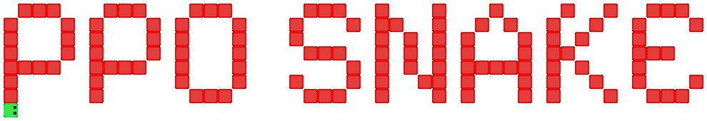
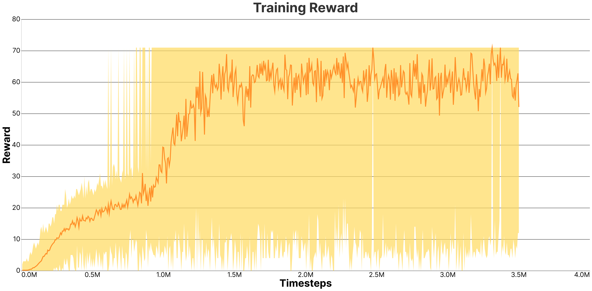
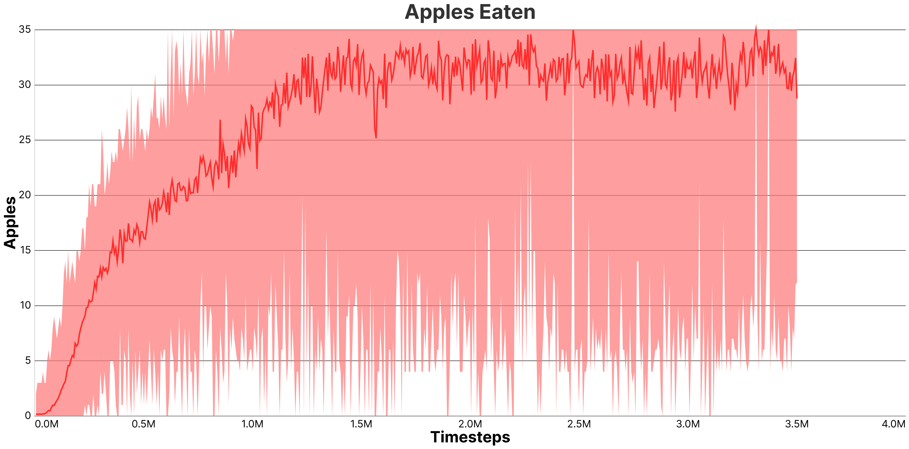
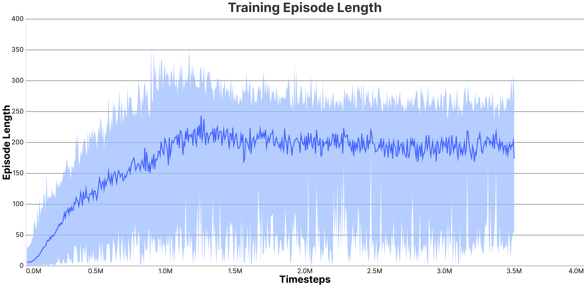

<p align=center>
   <i>Using PPO to beat snake.</i>
</p>
<br>
  
> [!NOTE]  
> This project was developed using Python 3.12


<br>
<br>


# 📖 INDEX:
 * 📌 [Project Overview](#-project-overview)
 * 🌐 [Model Structure](#-model-structure)
 * 🥇 [Reward Shaping](#-reward-shaping)
 * 👀 [Model Input](#-model-input)
 * 🎖️ [Results](#️-results)
 * 🚀 [Project Structure](#-project-structure)
 * 🤝 [Credits](#-credits)
 * 📄 [License](#-license)

<br>
<br>
<br>
<br>


# 📌 Project Overview

This project aims to use [**PPO**](https://en.wikipedia.org/wiki/Proximal_policy_optimization) *(Proximal Policy Optimization)* to beat the game of [**snake**](https://en.wikipedia.org/wiki/Snake_(video_game_genre)).   
The main goal was to train a reinforcement learning agent capable of learning the game from scratch.  
Along the way, this project became a deep dive into PPO: understanding how it works, tuning hyperparameters, stabilizing training, and analyzing learning behavior through metrics. 

> Here is a gameplay demo of the final agent trained for 20M timesteps  
> (You can find the model in `/agent/pretrained_models/20M_timesteps.pth`)

<p align=center>
   
</p>

<p align=center>
   
   
   
   
</p>

<br>
<br>

# 🌐 Model Structure

The `ppo_agent.py` file contains 2 classes:
- The **PPOAgent** class, which contains an implementation of the PPO algorithm
- The **FeedForwardNN** class, which is the **ActorCritic** model

The **ActorCritic** model consists of a **CNN** with convolutional layers increasing from 32 to 64 feature maps and 2 fully connected layers of 32 neurons each
 


<br>
<br>

# 🥇 Reward Shaping

The reward function is intentionally minimal: **only +1 if the snake eats** food and when the snake dies, it simply starts a new game.  
This reward shaping might seem too sparse for PPO, but out of all the rewards shaping I've tried, it performed the best.

<br>
<br>

# 👀 Model Input

The agent receives an observation tensor of shape **(C, H, W)** directly from the environment.  
In this project the shape is (3, 10, 10):  
-	Channel 0 → Snake **head** position  
- Channel 1 → Snake **tail** positions  
- Channel 2 → **Food** position  
  
*Each channel is a binary grid (0 or 1) aligned with the game board.  
Before being passed to the network, the observation is batched to shape (N, 3, 10, 10) for PyTorch.*


<br>
<br>

# 🎖️ Results

After training the model for 20M timesteps, here are the results:

> This is the reward graph, which shows the model learning and getting more reward.



> This is the score graph, which shows the model score during training.  


  
> This is the episode length graph.
> It represents the duration of the games during training.



> Below are the hyperparameters used during training.
 ```json
    {
        "agent": {
            "timesteps_per_batch": 6400,
            "max_timesteps_per_episode": 3200,
            "gamma": 0.98,
            "n_updates_per_iteration": 10,
            "clip": 0.2,
            "lr": 0.0004
        },
        "env": {
            "max_steps": 46,
            "obs_shape": [
                4,
                6,
                6
            ],
            "action_shape": [4]
        }
    }
 ```


<br>
<br>

# 🚀 Project Structure  

<br>

**`train.py`**: the script where you can train the model.  
*(If you want to make another training script, you can simply use `model.learn(timesteps)`)*  
Params:  
```py
--train-ts 20_000_000  # Number of timesteps to train the model
```
```py
--ci 50_000  # Number of timesteps between checkpoint saves
```
```py
--vf 500  # Number of timesteps between live evaluation runs, to see how it's doing
```

<br>

---

**`play.py`**: the script where you can test the trained model once training is completed.  
Params:  
```py
--path "agent\pretrained_models\20M_timesteps.pth"  # Path to the model file (file name included). It can be either absolute or relative to the project root directory
```
```py
--disable-gui  # No value needed, disables the GUI and runs the environment in CLI mode
```

<br>

---

**`plot.py`**: the script where you can plot the data collected automatically from training.  
*(no params)*

---

**`debug/`**: the folder where debug scripts are kept.  
> [!NOTE]
> The scripts inside this folder needs to be run as a module:
> ```ps
> py -m debug.script_name
> ```

  * **`test_ppo_agent.py`**: Script to test whether the PPOAgent can learn on the CartPole environment *(not working since the model was adapted for a discrete action space)*
  * **`test_snake_env.py`**: script to test if an agent can learn from the env *(to test if the env works)* using Stable-Baselines3 to verify learnability of the Snake environment
  * **`test_snake_gui.py`**: script to test the env gui
  * **`test_snake_logic.py`**: script to play snake on the cli to test if the logic is correct and make sure there aren't any bugs 
  * **`test_snake_reward_system.py`**: script to play snake and have a feedback of the reward received for every move *(important to test the reward and avoid reward hacking from the agent)*


<br>
<br>

# 🤝 Credits
Special thanks to [Eric Yang Yu](https://ericyangyu.github.io/) for his [PPO tutorial](https://medium.com/analytics-vidhya/coding-ppo-from-scratch-with-pytorch-part-1-4-613dfc1b14c8) and [Ettore](https://sa1g.github.io) for structural guidance and debugging support.


<br>
<br>

# 📄 License
This project was released under [MIT License](https://github.com/paolomalgarin/snake-ppo/blob/main/LICENSE.txt).
